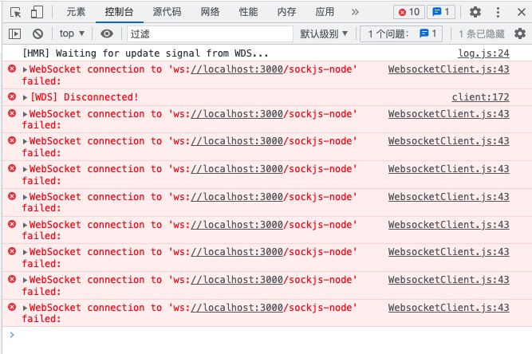
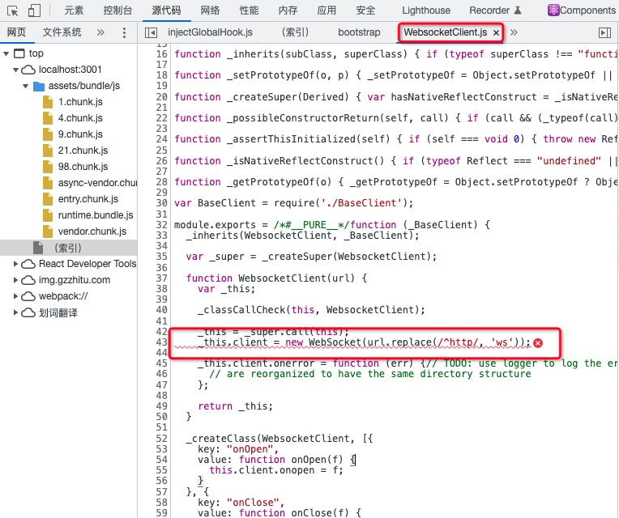
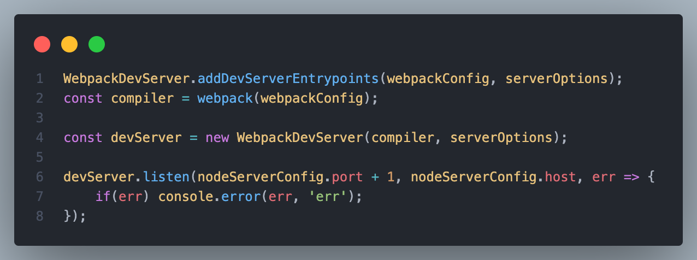
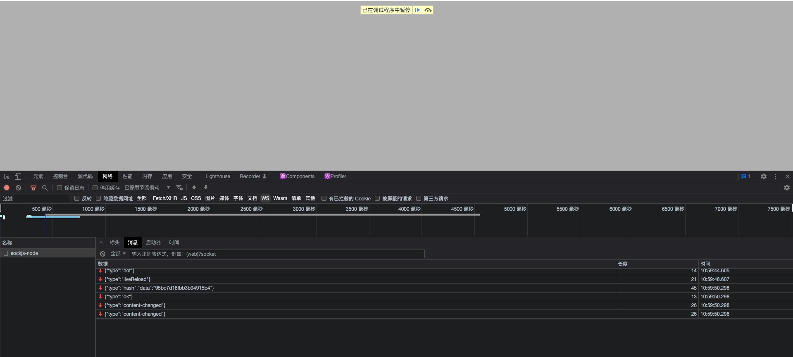
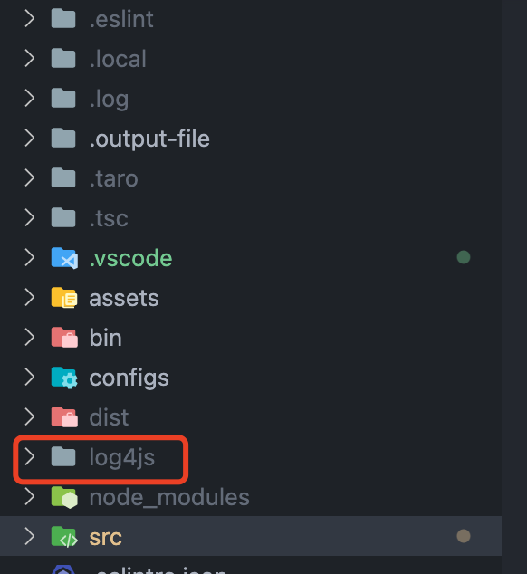
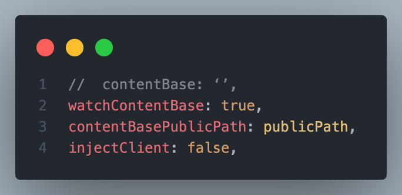

#### 源码版本

> os：macOS   
> webpack：4.43.0  
> webpack-dev-server：3.11.2

## 背景

最近入职了新公司，项目用的内部自研脚手架(react+ts+webpack+gulp+koa)，其中除了前端webpack的devServer，还用koa实现了一套MVC风格的中间层服务，让我顿时来了兴趣，赶紧 `npm start` 起来，找到默认打开页面的页面，随便改几个字，控制台显示开始重新编译，可编译成功后浏览器却没动静，按理webpack的热更新会给浏览器推送最新编译后的文件信息，浏览器更新最新文件后是会自动刷新的，接着又改了几个字，编译之后浏览还是器没反应，问了其他同事，他们表示从来没用过什么热更新，是的，你没有看错，<span style="color:#dd0000">公元2022年的react项目没有热更新</span>，在这个很多人都用上 `vite` 来实现瞬间热更新的年代，怎么还有手动刷新的道理，是时候来拯救一下小伙伴们的开发体验了

> koa服务作用:  
> 1、给跨域请求当代理  
> 2、用来规范和约束接口字段ts类型  
> 3、对于后端返回的数据可以做二次逻辑处理

## 热更新失效的原因

常规套路，先打开控制台瞅瞅





不看不知道，一看就是问题，问题也很清晰， `WebSocket connection to 'ws://localhost:3000/sockjs-node' failed:` , 意思就是websocket在连接这个地址的失败了，原来这问题一直都在眼皮子底下啊... 从 `WebsocketClient.js` 中也可以看出来在webpackSocket实例化的时候就报错了，那就是 `ws://localhost:3000/sockjs-node` 这个地址有问题了，地址中 `ws` 是协议，，大概率是 `localhost` 后面的端口和地址有问题，这时，偷瞄了一眼项目运行的地址，


好家伙! 端口不对啊，项目启动端口是 `3001` ，这边socket连接的端口是 `3000` ，都是是用的 `webpack-dev-server` (后面简称wds) 提供服务，端口不一致怎么玩，为了验证我的想法，那就现场以验证一下3001吧


不出所料，果然是端口问题, 那就找下车祸现场吧

## 问题1-端口

因为项目脚手架是自定义的，就从参数配置的部分忘里面看，在看到调用webpack和wds的时候，发现有些不对劲了，在开启wds监听事件的时候端口加了+1, 因为项目还有启了个koa服务用的是3000端口，区分端口以防占用，这里可以理解，不过在这个地方临时+1的话，和其他webpack的配置就不统一的，看到这问题已经浮现了



找到公共配置webpack的地方+1应该就行了，不过现在又有个问题了，ws地址的是怎么生成的呢？这个先给自己挖个坑吧，后面补上


## 问题2-无限刷新

前面ws地址没毛病了，这边又有幺蛾子了，项目启动之后，浏览器一直疯狂自动刷新(所以前面验证ws地址的时候还是打了个断点才得点空闲的)，一坑更比一坑深啊... 本着追本溯源的精神，先找下是哪里触发更新的，
触发的地方是在下面的文件，也就是用于监听服务端推送消息的 `client/index.js` ，在监听消息type为 `ok` 有可能会调用 `reloadApp()` 方法， `content-changed` 时会调用 `location.reload()` 刷新页面，这说明目前看到的无限刷新页面，其实就是服务端无限推送了 `ok` 或者 `content-changed` 消息

> node_modules/webpack-dev-server/client/index.js

```js
  var onSocketMessage = {
      // line:107-124
      ok: function ok() {
          sendMessage('Ok');

          if (options.useWarningOverlay || options.useErrorOverlay) {
              overlay.clear();
          }

          if (options.initial) {
              return options.initial = false;
          } // eslint-disable-line no-return-assign

          reloadApp(options, status);
      },
      'content-changed': function contentChanged() {
          log.info('[WDS] Content base changed. Reloading...');
          self.location.reload();
      },
  }
```

### 梳理思路

梳理下wds的热更新过程吧
* 项目启动后，浏览器通过`new WebSocket(url)`和wds建立ws连接，浏览器监听服务端推送事件，wds监听(watch)本地文件
* 本地项目文件有变化，将会触发watch，进而触发ws事件，把新文件的hash推送给浏览器端
* 浏览器拿到最新文件的hash值后，发送http请求拿到最新文件
* 获取最新文件后，替换老文件
* 最后重新渲染页面

### 接近真相

既然是文件变化后会触发watch->ws，那就可以看下控制台的消息来验证一下，可以看到 `content-changed` 类型是刷新前最后一个消息，打断点试了几次，每次刷新前他都是浏览器接受到的最后一个消息，这从侧面说明刷新就是 `content-changed` 消息引起的无限刷新



接着就去服务端看下推送 `content-changed` 消息的地方吧, 是在wds的主文件的_watch方法里面，根据watch的文件目录，当有文件变化时会触发 `change` 的回调方法，方法里面的 `sockWrite` 会发送socket消息给浏览器端，消息类型就是 `content-changed`

> node_modules/webpack-dev-server/lib/Server.js

```js
_watch(watchPath) {

    ...

    // line: 1015-1023
    const watcher = chokidar.watch(watchPath, watchOptions);
    // disabling refreshing on changing the content
    if (this.options.liveReload !== false) {
        watcher.on('change', (path) => {
            console.log(`File ${path} has been changed`);
            this.sockWrite(this.sockets, 'content-changed');
        });
    }
    this.contentBaseWatchers.push(watcher);
}
```

### 扒出元凶

到此为止，已经基本接近真相了，不过还是想验证一下，直接 `console` 一下 `change` 的回调参数，看看究竟是什么文件在一直变化。从打印结果来看，是一个 `.log` 结尾的文件，而且是在 `log4js` 文件夹下，我恍然大悟，看来是日志捣的鬼


这时联想到项目内部的koa中间层服务，用 `log4js` 来记录各种日志，其中就有利用中间件拦截路由，记录路由的日志，然后直接输出到工程目录下的 `log4js` 文件夹下，从而触发了watch，但其实真正的项目文件没有变化，webpack也根本就没有编译，直接给浏览器端推送了 `content-changed` 消息，然后 页面刷新->打印日志->触发watch，会三个一直循环执行，至此真相大白！



### 为什么会watch整个工程目录？

因为日志文件输出文件夹是在工程根目录下，那说明watch的文件路径是整个工程根目录下的所有文件，上面的 `_watch()` 方法中传入了一个 `watchPath` 参数，这里顺着捋一下， `_watch()` 方法其实是在 `setupWatchStaticFeature()` 方法中调用的

> node_modules/webpack-dev-server/lib/Server.js

```js
  // line:435-450
  setupWatchStaticFeature() {
      const contentBase = this.options.contentBase;

      if (isAbsoluteUrl(String(contentBase)) || typeof contentBase === 'number') {
          throw new Error('Watching remote files is not supported.');
      } else if (Array.isArray(contentBase)) {
          contentBase.forEach((item) => {
              if (isAbsoluteUrl(String(item)) || typeof item === 'number') {
                  throw new Error('Watching remote files is not supported.');
              }
              this._watch(item);
          });
      } else {
          this._watch(contentBase);
      }
  }
```

而 `setupWatchStaticFeature()` 函数是在 `setupFeatures()` 方法中调的，而 `setupFeatures()` 是在wds的 `constructor` 中调用的，可以理解为是wds实例化的时候，需要初始化一些功能，比如文件watch、设置proxy、设置middleware、提供html等等， `setupFeatures` 就是干这个的。

```js
class Server {
    constructor(compiler, options = {}, _log) {
        ...,

        this.setupFeatures();

        ...,

    }
    setupFeatures() {
        const features = {
                ...,
                // Todo rename to `watchStatic` in future major release
                watchContentBase: () => {
                    this.setupWatchStaticFeature();
                },
                ...,
            }
            ...,

            if (this.options.watchContentBase) {
                runnableFeatures.push('watchContentBase');
            }
    }
}
```

从上面的 `setupWatchStaticFeature` 方法看到， `_watch` 参数是 `contentBase` ，查阅官方文档，[contentBase](https://v4.webpack.docschina.org/configuration/dev-server/#devserver-contentbase)参数是告诉服务器从哪个目录中提供内容。不过看了项目中wds的配置，是没有配置的



这里没有配置的话, wds在初始化的时候会调用 `normalizeOptions` 方法 ，给一些没有配置的参数设置默认值

> node_modules/webpack-dev-server/lib/Server.js

```js
class Server {
    constructor(compiler, options = {}, _log) {
        ...
        // line:70
        normalizeOptions(this.compiler, this.options);
    }
```

可以看到，如果 `contentBase` 为 `undefined` ，则会默认设置为当前主进程的工作目录，所以就是 `项目工程/*`

> node_modules/webpack-dev-server/lib/utils/normalizeOptions.js

```js
function normalizeOptions(compiler, options) {
    // Setup default value
    options.contentBase =
        options.contentBase !== undefined ? options.contentBase : process.cwd();

    ...
}
```

## 解决问题

至此问题已经比较清晰了，目前想到有以下两种解决方案：

### 1、配置 `contentBase`

目前项目的打包输出文件目录是在工程根目录下 `dist` 文件夹，可以设置 `contentBase` 为工程根目录下 `dist/` 文件夹 ，这样就可以在有文件更新且打包完成后重发
`content-changed` 消息，从而触发页面重新加载


  

### 2、配置watch时的文件忽略

wds的配置中有个[watchOptions.ignored](https://v4.webpack.docschina.org/configuration/watch#watchoptions-ignored)参数，这个选项可以排除一些巨大的文件夹，例如node_modules等，这里配置成 `[/log4js/]` 就行了，wds的watch是依赖第三方库 `chokidar` 实现的，在调用时会传入我们配置的这个参数，达到忽略监测的效果

## 总结

解决过程中主要遇到两个问题
1. 端口问题 
2. 无限刷新问题

其中无限刷新可以从两个角度去解决，一个是配置 `contentBase` ，精确watch文件的范围，另一个是配置 `watchOptions.ignored` 忽略日志文件，个人比较倾向于第一种配置 `contentBase` ，因为监测范围太大，目前整个工程下分布着多个子项目，对于非项目文件的变更也会出发watch回调，会造成不必要更新，不如直接监测项目编译后输出文件的文件夹，这样精确。

热刷新问题解决了，之所以叫热刷新，是因为每次都是整个页面的`reload`，并没有保留刷新前页面的状态，比如刷新后文本框输入的值会丢失等，所以并不是真正的热更新，目前看来这个问题可能不是配置问题那么简单，应该是项目中`react-hot-loader`的用法和项目结构的问题，这个问题后面再继续研究吧
